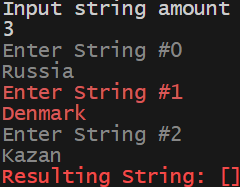

## Задача поиска строк длины меньшей или равной 3 в заданном массиве (нахождение списка)

### Постановка задачи: Написать программу, которая из имеющегося массива строк формирует новый массив из строк, длина которых меньше, либо равна 3 символам. Первоначальный массив можно ввести с клавиатуры, либо задать на старте выполнения алгоритма. При решении не рекомендуется пользоваться коллекциями, лучше обойтись исключительно массивами.

1. Репозиторий: https://github.com/manger32/Test_Main
2.  - Блок-схема алгоритма общая: 
    - Псеводокод процедуры выбора строк(FindAllOfLengthLessThan3Strings): 
3. ✅ Этот файл
4. Program.cs
5. Использовать контроль версий в работе над этим небольшим проектом (не должно быть так, что всё залито одним коммитом, как минимум этапы 2, 3, и 4 должны быть расположены в разных коммитах)

6. Вывод программы на примерах:

Примеры:
[“Hello”, “2”, “world”, “:-)”] → [“2”, “:-)”]
[“1234”, “1567”, “-2”, “computer science”] → [“-2”]
[“Russia”, “Denmark”, “Kazan”] → []

7. Примечание: для диаграмм воспользовался ресурсом: https://programforyou.ru/block-diagram-redactor